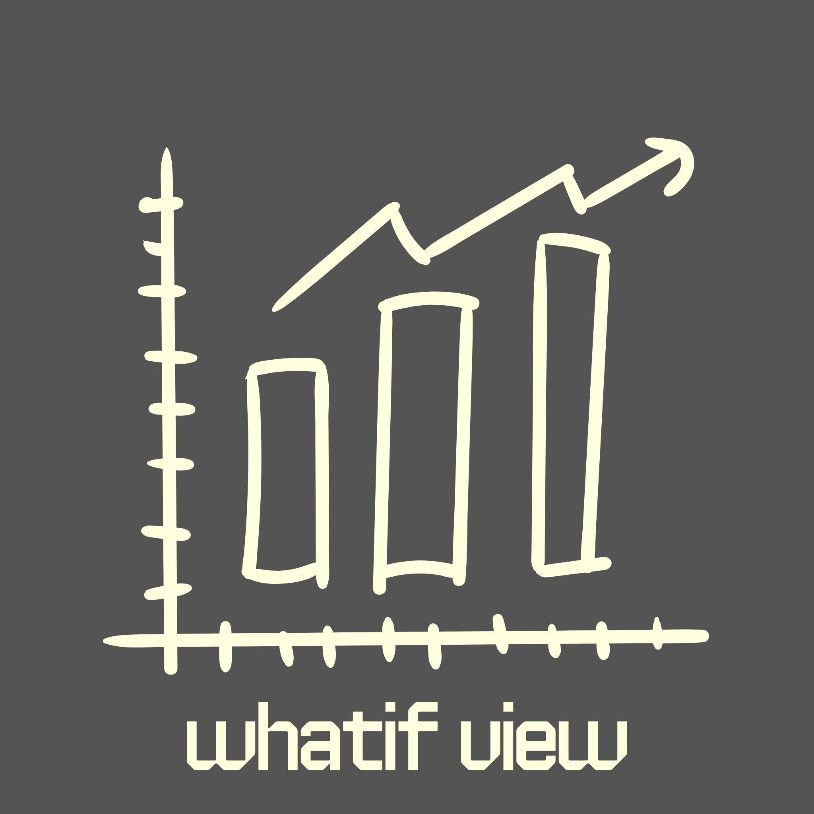

# WhatIF



A stock portfolio "what if" simulator. Enter any tickers, a date range, and an investment amount to see exactly what your returns would have been — with support for recurring DCA contributions.

## What you can do

- Simulate a lump-sum investment in any publicly listed stock
- 🕰️ Layer recurring investments (dollar-cost averaging) at any interval
- 📈 Compare multiple tickers side by side on a single interactive chart
- 💸View a full analytics breakdown: total invested, shares held, average price, last price, absolute and percentage returns
- Sort the analytics table by any column (returns, average price, etc.)
- Drag and reorder analytics columns

## Installation

**Requirements:** Node.js 18+, pnpm

```bash
# Clone the repo
git clone https://github.com/your-username/whatifview.git
cd whatifview

# Install dependencies
pnpm install

# Start the dev server
pnpm dev
```

## Commands

```bash
pnpm dev      # Start dev server at localhost:5173
pnpm build    # Type-check + build for production
pnpm preview  # Preview the production build
pnpm lint     # Run ESLint
```
